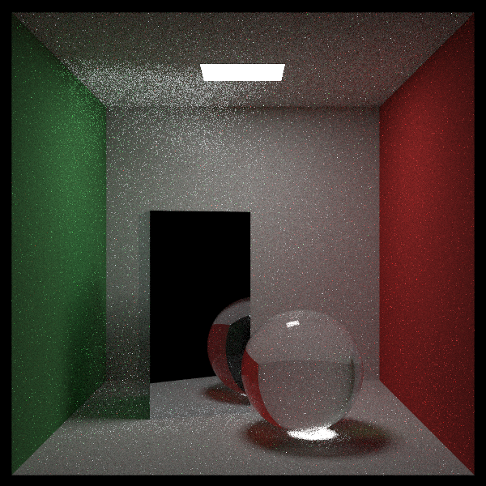

# arrt
> Alex Riegler's Ray Tracer

## Table of contents
* [General Info](#general-info)
* [Screenshots](#screenshots)
* [Setup](#setup)
* [Usage](#usage)
* [Features](#features)
* [To-do's](#to-dos)
* [Status](#status)
* [References](#references)
* [Author](#author)

## General Info
ARRT is a ray tracer written in C++. My goal with this project was to understand how ray tracing works. In the future, I plan to expand upon this project by adding more features, such as, support for .obj files and skyboxes.

## Screenshots
More to come!

## Setup
This project uses Microsoft Visual Studio 2019. You can clone the repository and open it using MSV 2019.

## Usage
To-do:

`code-example`

## Features
* Spheres, Rectangles, Volumes.
* Diffuse, Metal, Dielectric Materials.
* Depth of Field, Motion Blur.
* Bounding Volume Hierarchy via Axis-Aligned Bounding Boxes.
* Textures, Perlin Noise.
* Monte Carlo Path Tracing

## To-do's
* Triangles.
* .obj file support.
* Surface textures.
* Skybox.
* Multi-threading.

## Status
Project is: _in progress_

## References
Project inspired by [_Ray Tracing in One Weekend_](https://raytracing.github.io/books/RayTracingInOneWeekend.html), [_Ray Tracing: The Next Week_](https://raytracing.github.io/books/RayTracingTheNextWeek.html), [_Ray Tracing: The Rest of Your Life_](https://raytracing.github.io/books/RayTracingTheRestOfYourLife.html).

## Author
Created by Alex Riegler.
